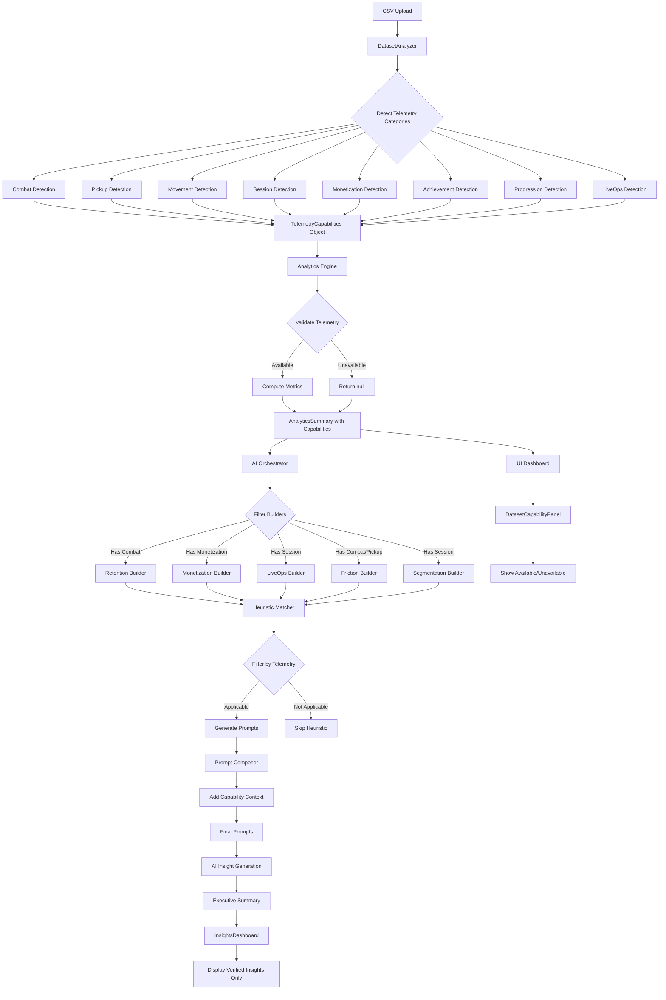
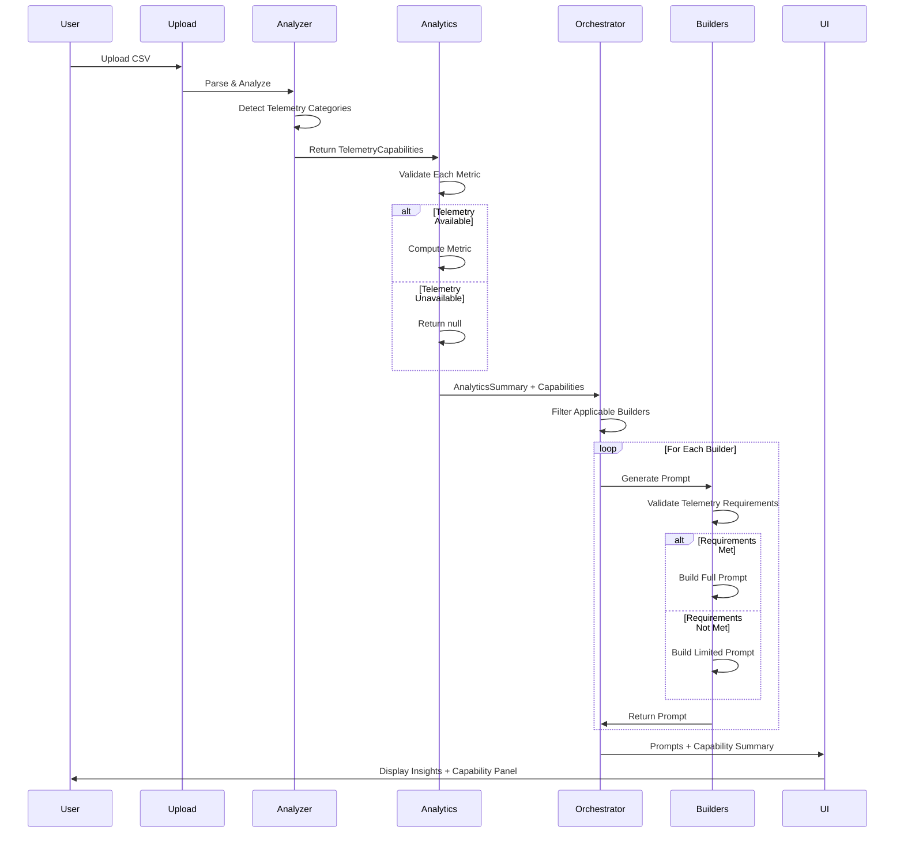
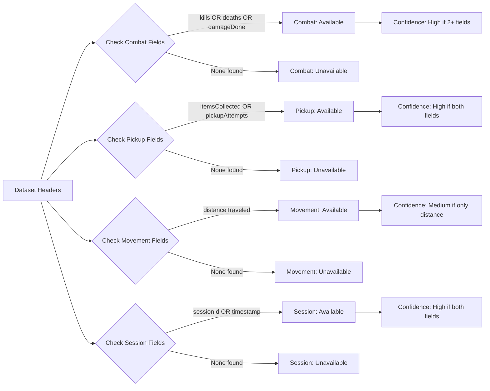
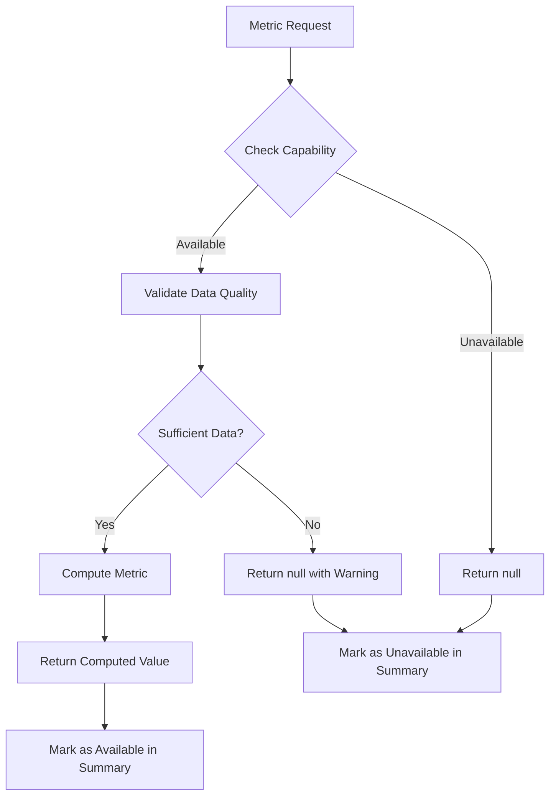
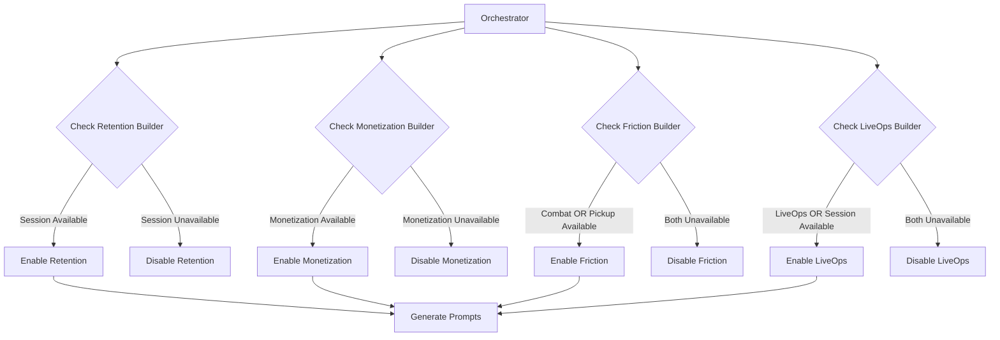
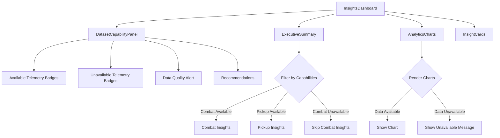
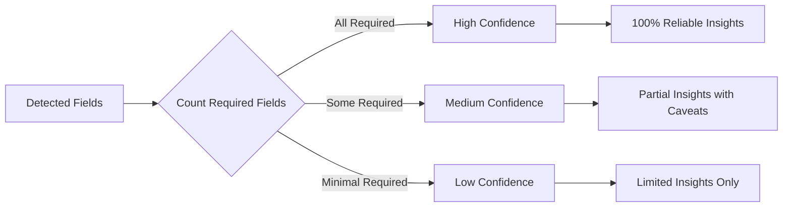
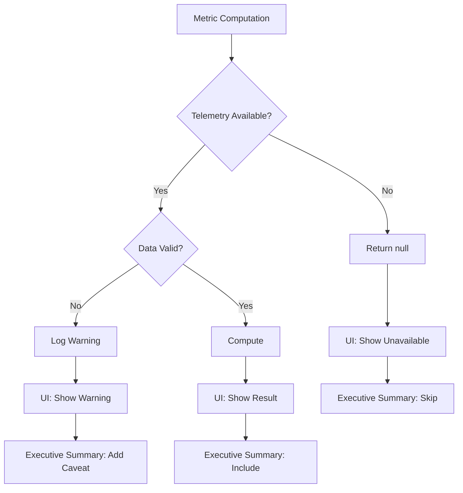

# Telemetry Capability Detection Architecture

## System Flow Diagram



## Data Flow Architecture



## Telemetry Detection Logic



## Capability-Aware Metric Computation



## Builder Filtering Logic



## UI Component Hierarchy



## Confidence Scoring System



## Error Handling Flow



## Type System Architecture

```typescript
// Core Types Hierarchy
interface TelemetryCapabilities {
  combat: TelemetryCategoryStatus
  pickup: TelemetryCategoryStatus
  movement: TelemetryCategoryStatus
  session: TelemetryCategoryStatus
  monetization: TelemetryCategoryStatus
  achievement: TelemetryCategoryStatus
  progression: TelemetryCategoryStatus
  liveops: TelemetryCategoryStatus
}

interface TelemetryCategoryStatus {
  available: boolean
  confidence: 'high' | 'medium' | 'low'
  detectedFields: string[]
  missingFields: string[]
  requiredFields: string[]
}

interface AnalyticsSummary {
  // Existing metrics (now nullable)
  killDeathRatio: number | null
  pickupEfficiency: number | null
  // ... etc
  
  // New capability metadata
  capabilities: TelemetryCapabilities
  datasetQuality: 'excellent' | 'good' | 'partial' | 'minimal'
  metricsAvailable: Record<string, boolean>
}
```

## Integration Points

### 1. CSV Upload → Capability Detection
```typescript
// app/upload/page.tsx
const handleFileUpload = async (file: File) => {
  const data = await parseCSV(file);
  const analyzer = new DatasetAnalyzer();
  const capabilities = analyzer.analyzeDataset(data);
  const summary = generateAnalyticsSummary(data, capabilities);
  // ... continue with insights generation
};
```

### 2. Analytics Engine → Conditional Computation
```typescript
// lib/analytics.ts
export function generateAnalyticsSummary(
  data: TelemetryRow[],
  capabilities: TelemetryCapabilities
): AnalyticsSummary {
  return {
    capabilities,
    killDeathRatio: capabilities.combat.available 
      ? computeKillDeathRatio(data) 
      : null,
    // ... other metrics
  };
}
```

### 3. Orchestrator → Builder Filtering
```typescript
// lib/ai/orchestrator.ts
private filterBuildersByCapabilities(
  builders: string[],
  capabilities: TelemetryCapabilities
): string[] {
  return builders.filter(builder => 
    this.hasRequiredTelemetry(builder, capabilities)
  );
}
```

### 4. UI → Capability Display
```tsx
// components/insights/DatasetCapabilityPanel.tsx
export function DatasetCapabilityPanel({ capabilities }) {
  const available = getAvailableCategories(capabilities);
  const unavailable = getUnavailableCategories(capabilities);
  
  return (
    <Card>
      <AvailableBadges categories={available} />
      <UnavailableBadges categories={unavailable} />
      <QualityAlert quality={getDatasetQuality(capabilities)} />
    </Card>
  );
}
```

## Key Design Decisions

### 1. Null vs Zero
- **Decision**: Use `null` for unavailable metrics, not `0`
- **Rationale**: Distinguishes "no data" from "zero value"
- **Impact**: Requires null checks throughout codebase

### 2. Confidence Levels
- **High**: All required fields present
- **Medium**: Some required fields present
- **Low**: Minimal fields present
- **Impact**: Affects insight generation and UI messaging

### 3. Builder Filtering
- **Decision**: Disable builders without required telemetry
- **Rationale**: Prevents generating invalid insights
- **Impact**: Fewer prompts generated, but higher quality

### 4. UI Transparency
- **Decision**: Always show capability panel
- **Rationale**: Users need to understand data limitations
- **Impact**: More UI space, but better user trust

## Performance Considerations

1. **Capability Detection**: O(n) scan of dataset headers (fast)
2. **Metric Computation**: Only compute available metrics (faster)
3. **Builder Filtering**: Early filtering reduces prompt generation (faster)
4. **UI Rendering**: Conditional rendering based on capabilities (efficient)

## Testing Strategy

### Unit Tests
- Capability detection for each telemetry category
- Metric computation with/without telemetry
- Builder filtering logic
- UI component rendering with various capabilities

### Integration Tests
- End-to-end flow from upload to insights
- Multiple dataset types (full, partial, minimal)
- Edge cases (empty, single-column, malformed)

### Test Coverage Goals
- Capability detection: 100%
- Metric computation: 95%
- Builder filtering: 100%
- UI components: 90%